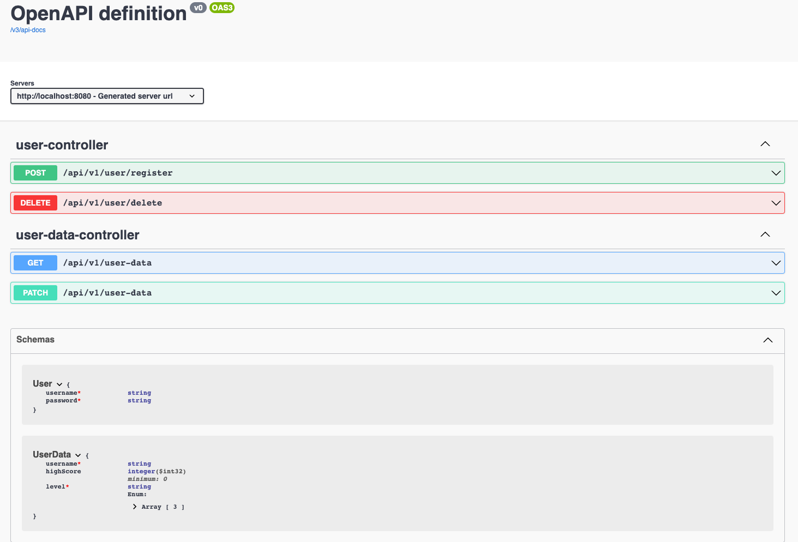

# RESTful API Endpoints

The client communicates with the server via a RESTful API. The server runs in development on **http://localhost:8080**.

All endpoints are secured by basic http authentication except for the *register endpoint* which is open and where a player can be added.

The swagger API documentation can be accessed via the route **http://localhost:8080/swagger-ui/index.html**.

The backend acts merely as a place where players can be added and player data like a high score can be saved and retrieved.

A MongoDB document database is used to persist data.
